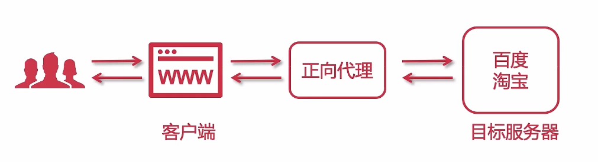
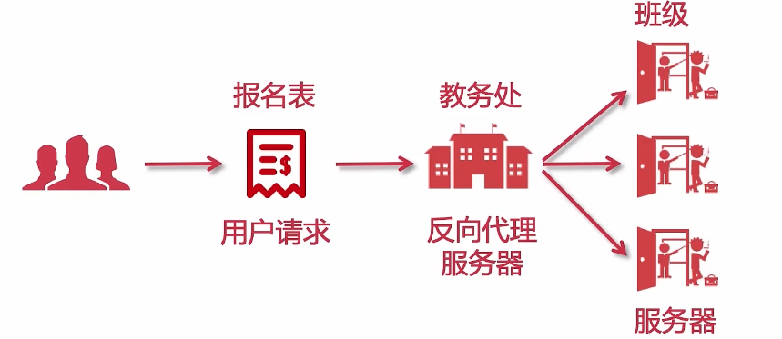

## NGINX 简介
### 1, 什么事Nginx?
   Nginx（engine x）是一个高性能的HTTP和反向代理web服务器，同时提供IMAP/POP3/SMTP服务

   （1） 主要功能是反向代理

   （2） 通过配置文件可以实现集群和负载均衡

   （3） 静态资源虚拟化

### 2, 常用的Web服务器？
	（1） MS IIS   asp.net
    （2） Weblogin, Jboss  传统行业，ERP，物流，电信，金融
	（3） Tomcat, Jetty  J2EE应用
	（4） Apache, Nginx  静态服务，反向代理
	（5） Netty  高性能服务器编程

### 3, 什么是反向代理？
（1）什么是正向代理？
* 客户端请求目标服务器之间的一个代理服务器
* 请求会先经过代理服务器，然后再转发请求到目标服务器，获得内容后最后响应客户端
注意：所谓的正向代理就是代理服务器替代访问方【用户A】去访问目标服务器【服务器B】
  
客户端用户并没有直接与服务器相连。正向代理隐藏了真实的客户端地址。可以很好地保护客户端的安全性。
(2) 什么是反向代理？
* 用户请求目标服务器，由代理服务器决定访问哪个IP
  
