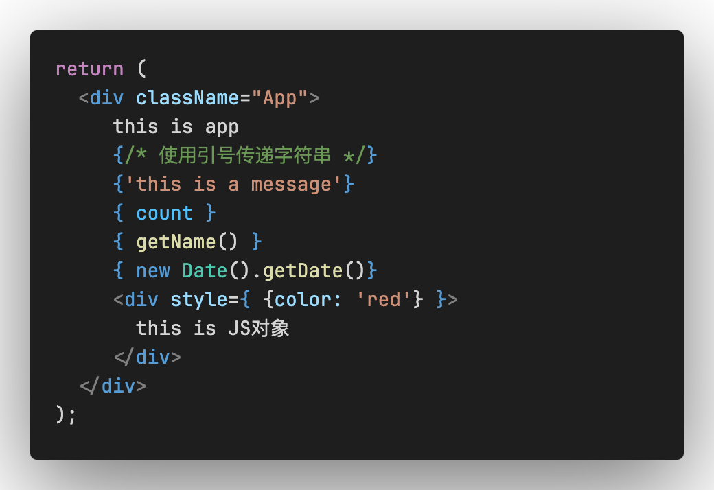

## React介绍
React有Meta公司研发，用于构建用户界面的JavaScript库

### React16 生命周期
组件在首次创建后，进行第一次的渲染称为挂载期，挂载期有些方法会被一次触发，然后是组件更新期，最后是组件卸载期

```js
(1) constructor() // 构造函数，初始化状态值
(2) getInitialStae() // 获取初始化的状态值， 
(3) getDefaultProps() // 获取默认的props值
(4) componentWillMount() // 首次渲染前进行
(5) render() // 组件开始渲染
(6) componentDidMount() // 组件渲染后执行的操作

注意：前6步中，其中getInitialStae,getDefaultProps已经被废弃掉啦
默认state值可以在构造方法中用 this.state = {} 设置
默认props值通过： static defaultProps = { } 设置

(7) componentWillReceiveProps() // 当父组件更新子组件的props时，该方法被调用
(8) shouldComponentUpdate() // props,state的时候, 决定该组件是否需要重新渲染执行的方法
(9) componentWillUpdate() // 当接收到新的props,state时，重新渲染前调用的方法：类似：componentWillMount
(10)componentDidUpdate() // 重新渲染之后调用的方法：类似：componentDidMount

(11)componentWillUnmount() // 组件卸载
```
### 开发环境搭建
```js
#执行命令
npx create-react-app myApp

#也可以全局安装create-react-app
npm install -g create-react-app
#查看版本
create-react-app -V
```

### 什么是J SX
 JSX是JavaScript和XML的缩写，表示在JS代码中编写HTML模版结构，它是React中编写UI模版的方式
 1，JSX的优势，包含了HMTL声明式模版写法，也包含了JS的可编程能力
 注意：JSX并不是标准的JS语法，它是JS的语法扩展，浏览器本身是不能识别的，需要通过解析工具做解析之后才能在浏览器中运行

### JSX高频场景
 在JSX中可以通过`大括号语法{}`识别JavaScript的表达式，比如常见的变量，函数调用，方法调用等等

 1，使用引号传递字符串<br />
 2，使用JavaScript变量<br />
 3，函数调用和方法调用<br />
 4，使用JavaScript对象<br />
 
 注意：if语句，switch语句，变量声明属于遇见，不是表达式，不能出现在`{}`中
