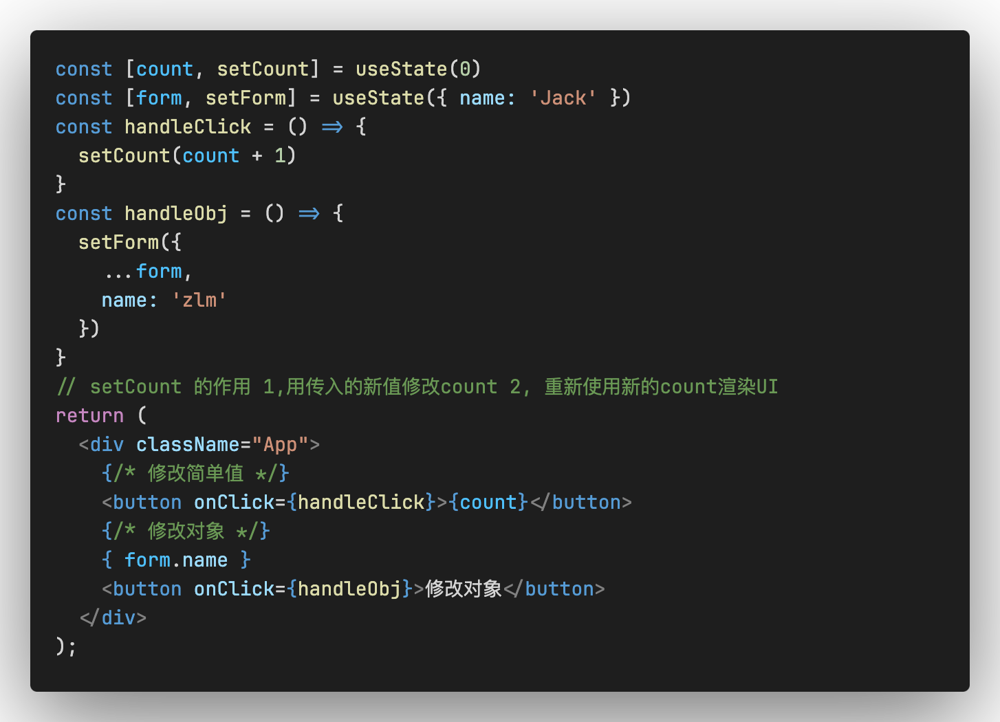
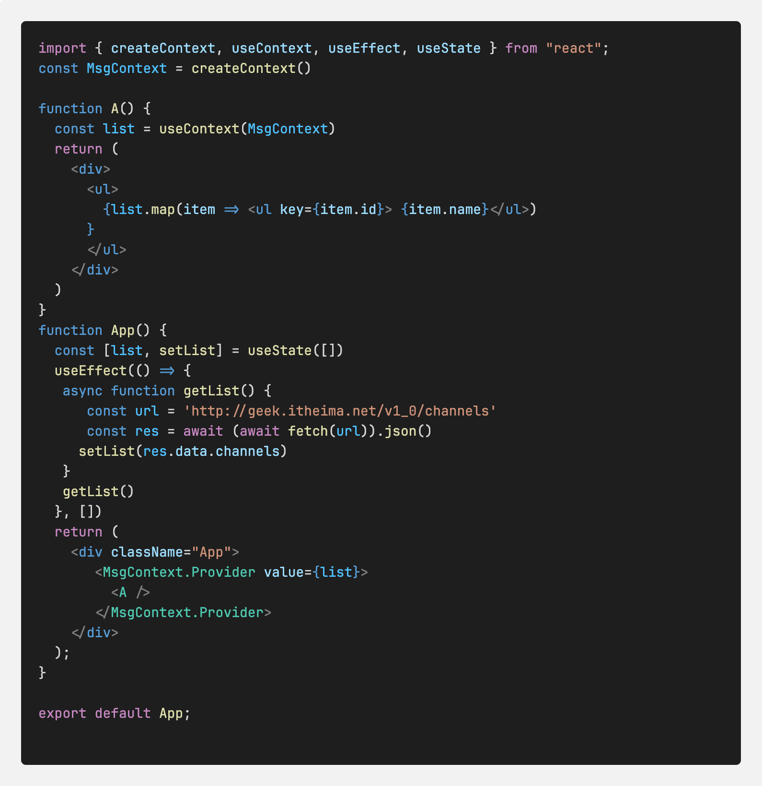
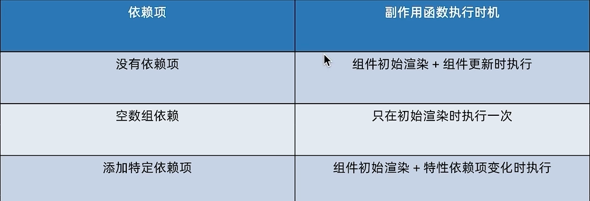
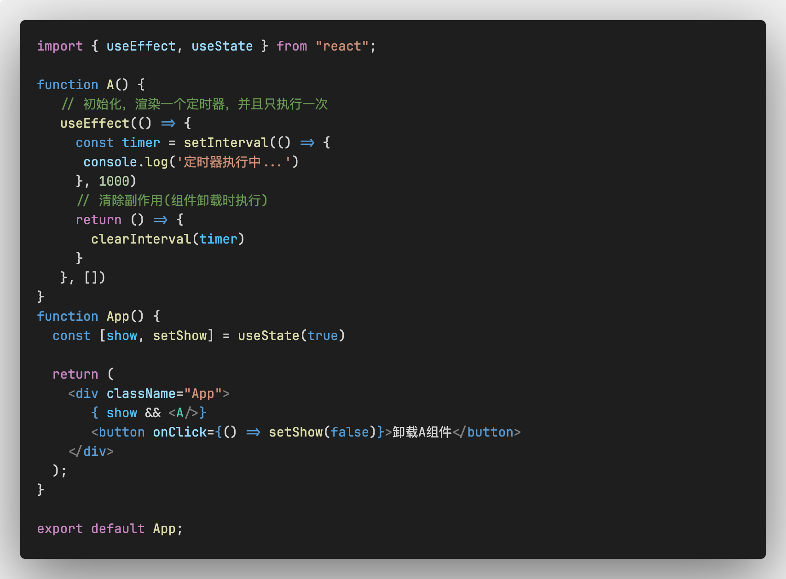
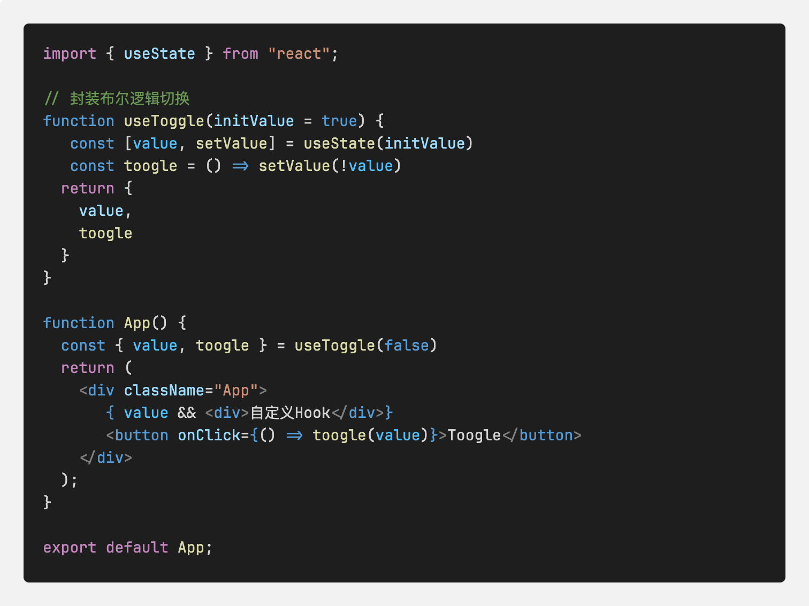

# React Hook函数

### 1, useState (状态变量)
状态变量，可以控制影响组件的渲染，和普通的JS变量不同，状态变量一旦发生变化，组件的视图UI也会跟着一起变化（数据驱动视图）

1，`useState` 是一个函数，返回值是一个数组

2，数组中的第一个参数是状态变量，第二个参数是set函数，用来修改状态变量的

3，useState的参数将作为count的初始值
```js
const [count, setCount] = useState(0)
# setCount 的作用 
1, 用传入的新值修改count 
2, 重新使用新的count渲染UI
```
在React中，状态被认为是只读的，我们应该始终替换它而不是修改它，直接修改状态不能引发视图更新

### 2，useState(修改对象状态)
规则：对于对象类型的状态变量，应该始终传给set方法一个全新的对象来进行修改


### 2, useRef (获取/操作DOM)
在React组件中获取操作DOM，需要使用`useRef`钩子函数, 分为两步：
1, 使用useRef创建ref对象，并于JSX绑定
```js
const inputRef = useRef(null)
<input type="text" ref={inputRef} />
```
2, 在DOM可用时，通过`inputRef.current`拿到DOM对象
```js
console.log(inputRef.current)
```
### 3, useEffect
`useEffect`是用于在React组件中创建不是由事件引起而是由渲染本身引起的操作，比如：发送AJAX请求，更改DOM

说明：可以理解为，没有用户参与的事件，页面渲染完毕，想做的一些动作，都可以放到useEffect中实现，所以称：`只由渲染引起的操作`

```js
useEffect(() => {}, [])
```
(1) 第一个参数： 是一个函数，也称做副作用函数，在函数内部可以放置要执行的操作<br/>
(2) 第二个参数： 可选，如果是一个数组， 在数组里放置依赖项，不同依赖项会影响第一个参数函数的执行，当是一个空数组的时候，副作用函数只会在组件渲染完毕之后执行一次<br/>
* Demo案例： 需求：在组件渲染完毕之后，立即从服务端获取数据并显示到页面中

注意：useEffect副作用函数在执行时机存在多种情况，根据传入依赖项的不同，会有不同的执行表现

注意：如果在Demo案例中，`useEffect`的第二个参数如果不传递，接口就会一直调用，因为，页面渲染完毕之后，执行`useEffect`, 获取到数据之后，执行`setList(list)`动作，状态变量的改变，会导致组件重新渲染，渲染完毕之后，又执行`useEffect`, 从而导致死循环

* useEffect(清除副作用)
在useEffect中编写的由渲染本身引起的对组件外部有影响的操作，也叫副作用，比如：在useEffect中开启了一个定时器，如果想在组件卸载的时候把这个定时器也清理掉，这个过程就叫做清理副作用
```js
useEffect(() => {
  // 比如开启一个定时器
  return () => {
	// 在这里清除定时器
  }
}, [])
# 注意： 清除副作用的函数最常见的执行时机是：在组件卸载时自动执行
```


### 4, 自定义Hook函数
概念：自定义Hook是以`use`打头的函数，通过自定义Hook函数可以用来实现`逻辑的封装和复用`

思路：
（1） 声明一个以use打头的函数<br/>
（2） 在函数体内封装可复用的逻辑<br/>
（3） 把组件中用到的状态或着回调return 出去， （对象和数组都行）<br/>
（4） 在哪个组件中要用到这个逻辑，就执行这个函数，解构出来状态和回调方法

### 5, ReactHooks是以规则
1, 只能在组件中或着其他自定义Hook函数中调用
2, 只能在组件的顶层调用，不能在嵌套的if, for,其他函数中