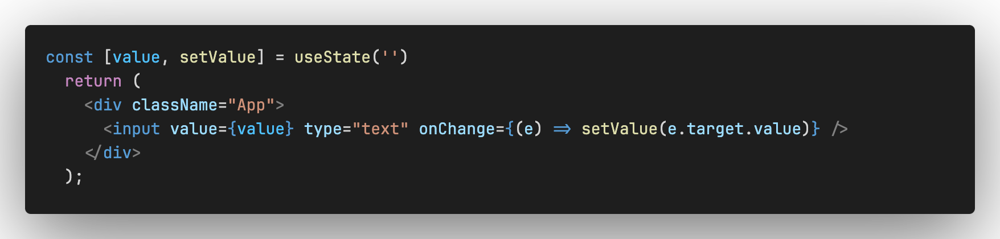

## React基础知识

### 1,JSX简单条件渲染
1，可以通过逻辑与运算符&&
2，通过三元表达式 ?:

### 2,JSX复杂条件渲染
解决方案：自定义函数 + if 判断语句


### 3,事件绑定
`on + 事件名称 = { 事件处理程序 }`， 整体上遵循驼峰命名法
```js
<button onClick={handleClick}></button>

# 事件参数e
const handleClick = (e) => {
	console.log(e)
}
# 传递自定义参数, 需要采用下面的方式
<button onClick={() =>handleClick('jack')}>click me</button>
const handleClick = (name) => {
	console.log(name)
}

# 同时想传递参数 e 和自定义参数
<button onClick={(e) => handleClick('java', e)}></button>
```
### 4, 组件
概念：一个组件就是用户界面的一部分，它可以有自己的逻辑和外观，组件之间可以相互嵌套，也可以复用多次，
在React中，一个组件就是首字母大写的函数，内部存放了组件的逻辑和视图UI，渲染组件只需要把组件当成标签书写。


### 5, 组件基础样式
React组件基础的样式控制有两种方式
1，行内样式
```js
<div style={{color: red, fontSize: '14px'}}></div>
#注意：多个单词，要按照驼峰的写法
```
2, class类名控制
```js
.foo {
	color: red
}
return (
	<div className='foot'></div>
)
```

### 6, 排序
注意：可以借助loadsh工具
```js
npm i loadsh
const list = [{
	name: 'zlm',
	age: 18
}, {
	name: 'james',
	age: 22
}]
import _ from 'loadsh'
# 三个参数，第一个：需要排序的数组， 第二个：根据哪个字段进行排序， 第三个：排序方式
_.orderBy(list, 'age', 'desc')
```

### 7，classnames优化类名控制
classnames是一个简单的JS库，可以非常方便的通过条件动态控制class类名的显示
（1） 第一种写法
```js
<span
  key={item.type}
  onClick={}
  className={`nav-item ${type===item.type && 'active'}`}
>
{item.text}
</span>
```
（2）第二种写法
classNames() 第一个参数：静态的类名，第二个参数：是一个对象，key表示要控制的类名，value表示条件， true的时候类名显示
```js
<span className={classNames('nav-item', { 'active' : type === item.type})}></span>
```
### 8, 受控表单绑定
