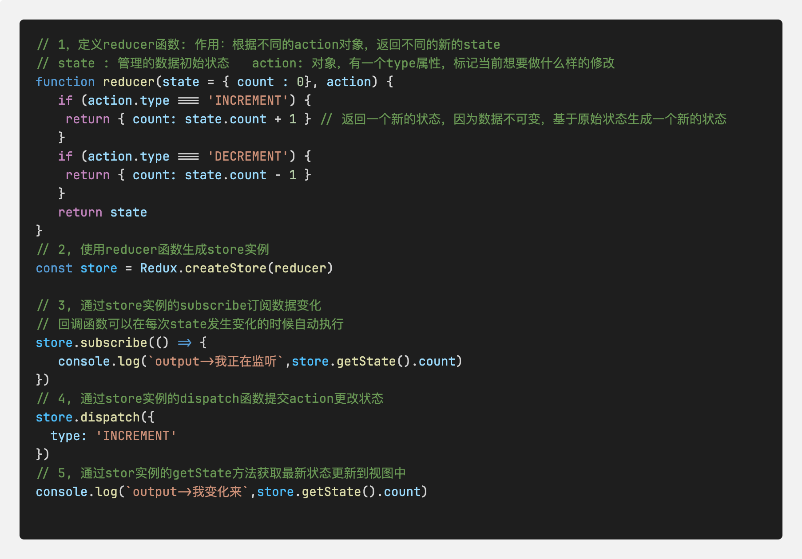

# 什么是Redux
Redux是React中最常用的集中状态管理工具，类似于Vue中的Pinia,Vuex, 可以独立于框架运行<br/>
使用步骤<br/>
1:定义一个reducer函数（根据当前想要做的修改返回一个新的状态）<br/>
2:使用`createStore`方法传入`reducer`函数，生成一个`store`实例对象<br/>
3:使用store实例的`subscrible`方法订阅数据的变化，数据一旦变化，可以得到通知<br/>
4:使用store实例的`dispatch`方法提交action对象，触发数据变化，告诉reducer你想怎么改变数据<br/>
5:使用store实例的`getState`方法，获取最新的状态数据更新到视图中<br/>
Demo案例：

注意：Redux把整个数据修改流程分成三个核心概念：分别是：`state`, `action`, `reducer`<br/>
1，state: 一个对象，存放着我们管理的数据状态<br/>
2，action: 一个对象，用来描述你想怎么修改<br/>
3, reducer: 一个函数，更具action的描述生成一个新的state<br/>

### 1, Redux + React 环境搭建
在React中使用Redux, 官方要求安装两个其他插件 `Redux Toolkit` 和 `react-redux`<br/>
1. `Redux Toolkit(RTK)` 官方推荐编写Redux逻辑的方式，是一套工具的合集，简化书写方式
（1）简化store的配置方法  （2）内置immer支持可变式状态修改  （3）内置thunk更好的异步创建
2. `react-redux` 用来链接`Redux`和`React组件`的中间件
  Redux -> react-redux ->React组件
```js
 npm i @reduxjs/toolkit react-redux
```
