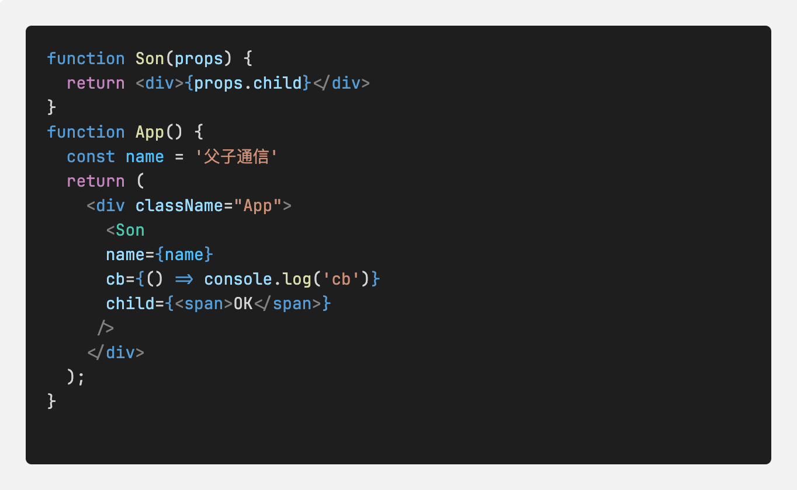
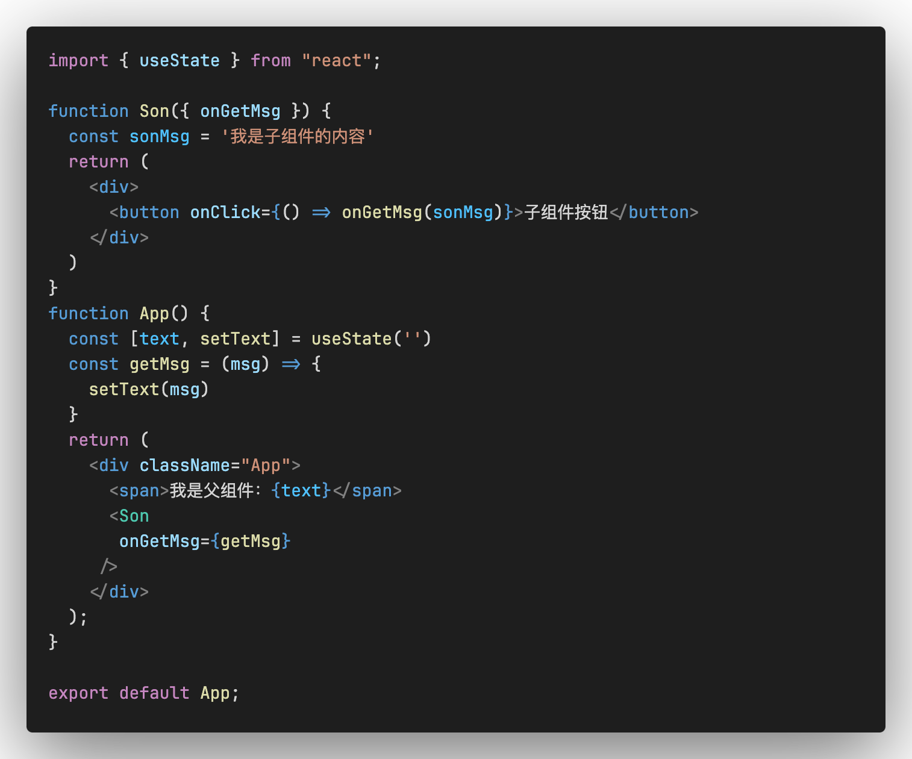
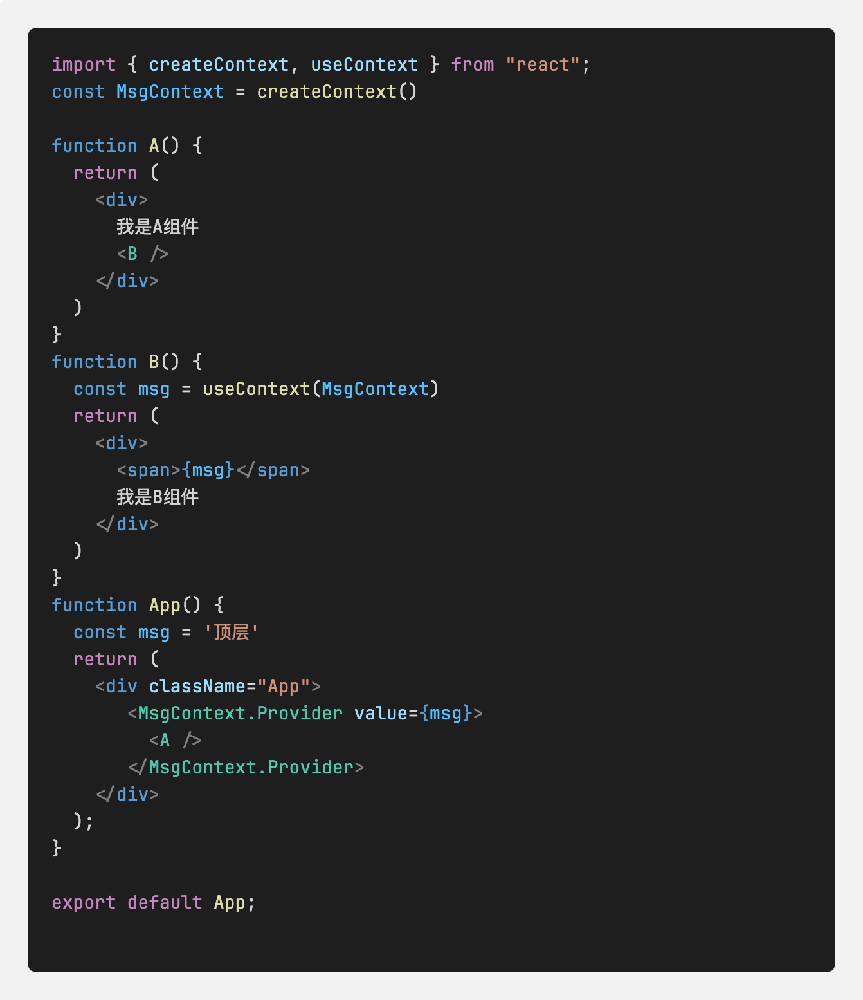

# React组件通信
概念：组件通信就是组件之间的数据传递，根据组件嵌套关系的不同，有不同的通信方法

### 1,父传子通信
实现步骤:<br />
(1) 父组件传递数据，在子组件标签上绑定属性<br />
(2) 子组件接受数据，子组件通过props参数接收数据<br />
注意：props 可以传递任意的数据， props是只读对象，子组件只能读取props中的数据，不能直接进行修改，父组件的数据只能父组件修改

注意：特殊场景，当把内容嵌套在子组件标签中，子组件会自动在名为children的pro属性中接收该内容
```js
<Son>
	<spn>我是子组件标签中的内容</spn>
</Son>
#获取方式
props.children
```
### 2,子传父通信
核心思路：在子组件中调用父组件中的函数并传递参数


### 3, 兄弟组件通信
使用状态提升实现兄弟组件通信，通过父组件进行兄弟组件之间的数据传递<br />
（1） A组件先通过子传父的方式把数据传递给父组件 <br />
（2） 父组件拿到数据之后，通过父传子的方式再传递给B组件 <br />

### 4, 跨层组件通信
核心：使用`Context`机制跨层组件通信<br />
实现步骤：<br/>
1, 使用`createContext`方法创建一个上下文对象`Ctx`<br/>
2, 在顶层组件中通过`Ctx.Provider`组件提供数据<br/>
3, 在底层组件中通过`useContext`钩子函数获取消费数据<br/>



